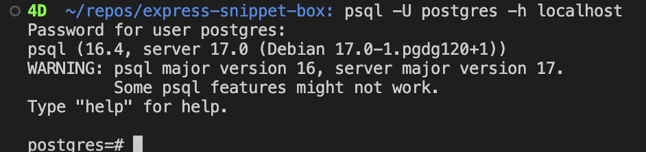

# Postgres VIA docker, initialize steps

- Set up dependencies for postgres on mac
  - `brew install libpq`
  - Check if its there: `which psql`
- Next login to docker, and get it online,
  - Once inside docker set up Optional settings:

1. name of project
2. POSTGRES_PASSWORD password
3. bind port 5432:5432
   **then in your terminal run:**

- `docker run --name some-postgres -e POSTGRES_PASSWORD=mysecretpassword -d postgres`
- Then run: `psql -U postgres -h localhost`
  - You will then be prompted for the password you justgave on step 2. `Password for user postgres:`

### Once you enter said password you should see this your terminal.

# curl command

`curl -d '{"username": "Chris"}' -H "Content-Type: application/json" -X POST localhost:3000/user`

## userModel suggestions from chad

1. **Combine First Name and Last Name into a Single Name**: The code attempts to combine `firstName` and `lastName` into a `name` object. It's important to ensure that this combined data structure aligns with the database schema requirements.

2. **Email Validation**: The regular expression used to validate the email may not cover all valid email formats. Consider using a more robust email validation technique.

3. **Password Hashing**: The code correctly uses `bcrypt` to hash the password. Ensure that you handle any potential errors that may occur during the hashing process.

4. **SQL Injection Prevention**: The current implementation of the SQL query is vulnerable to SQL injection as it directly inserts user data into the query. Consider using parameterized queries to prevent SQL injection attacks.

5. **Error Handling**: The error handling in the `createUser` method could be improved. Instead of generic error messages, provide more specific information about what went wrong and handle errors more gracefully.

6. **Return User Model**: When an error occurs during the user creation process, the method always throws a generic error message. It would be more informative to return `null` in this case and handle the error differently.

## getUserByEmail model

`// retreive user by email
async getUserByEmail(email: string): Promise<UserModel | null> {
try {
const sql = "SELECT password_hash FROM users WHERE email = $1";
const params = [email];
const client = await this.pool.query(sql, params);

      if (client.rows.length != 1) {
        throw new Error("Failed to create a new user. See logs for details.");
      }

      const data = client.rows[0];

      const user: UserModel = {
        id: data.id as number,
        firstName: data.name as string,
        lastName: data.name as string,
        email: data.email as string,
        passwordHash: data.password_hash.toString() as string,
        createdAt: data.created_at as Date,
      };

      // Suggest this for less code???
      // const name = `${firstName} ${lastName}`;
      // if (!name) {
      //   throw new Error("Invalid name format");
      // }

      return user;
    } catch (error) {
      console.error(error);
      return null;
    }

}`
